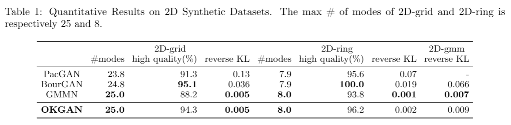
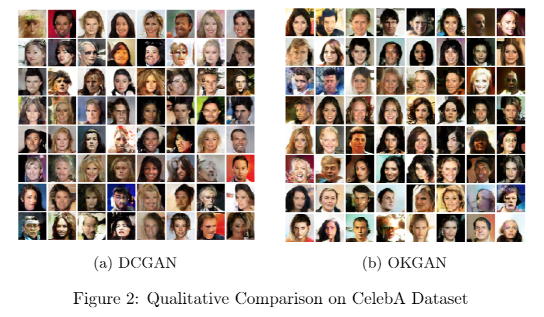

# Improving Implicit Generative Models via Online Kernel Methods
## Abstract:
One of the major breakthroughs in machine learning over the past five years has been the Generative Adversarial Network (GAN), a neural network-based implicit generative model which aims to mimic some underlying distribution given a dataset of samples. In contrast to many supervised problems, where one tries to minimize a simple objective function of the parameters, GAN training is formulated as a min-max problem over a pair of network parameters. GANs have shown impressive empirical success in some domains in the following sense: samples produced by the trained model do appear (subjectively) to fall within the support of the target distribution. But in prior work, researchers have been puzzled by unusual training behavior, including cycling and so-called mode collapse, and almost all prior work has avoided careful analysis of whether the estimated distribution does actually match the target in a quantitatively measurable sense. In this paper, we propose (a) new metrics to evaluate the performance of implicit generative models and (b) a new framework for training such a model using kernel-based non-parametric classifiers instead of the typical neural network discriminators. We call this the Online Kernel-based Generative Adversarial Networks (OKGAN), and we emphasize that it can be trained efficiently. We show that using classical results from online learning with kernels, OKGANs are guaranteed to match the target distribution under certain oracle guarantees on the generator family. Empirically, our models do a much better job of minimizing a reverse-KL-divergence between the trained model and the target distribution, and as expected from the theory, OKGAN does not exhibit mode collapse or cycling and performs dramatically better than many of the classical GAN formulations on low-dimensional synthetic data. We also compare performance on classical vision datasets such as MNIST, SVHN, CelebA, and CIFAR-10, and show comparable performance. 
## How to run codes
- OKGAN: Go to "OKGAN" folder -> run "Testing_Online_Kernel_GAN.ipynb"

## Results

## Requirements
pytorch 1.0.0

numpy 1.14.5

matplotlib 2.2.2

sklearn 0.19.1

